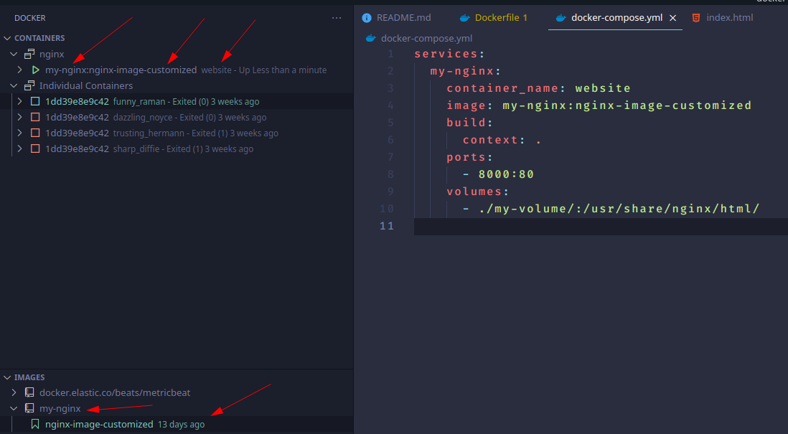
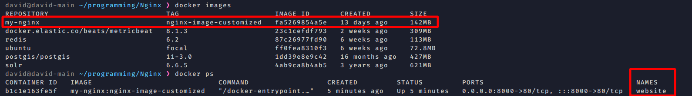

# NGINX with python 

[youtube turorial](https://www.youtube.com/playlist?list=PLOLrQ9Pn6cawvMA5JjhzoQrnKbYGYQqx1)

# Introductioin

Nginx is a web server with multiple purpouses like:
 
 - Web serving
 - reverse proxying
 - caching
 - load balancing
 - media streaming
 - and more


Depending of your implementation you may have some intermediate server which is going to allow you to in this case translate or communicate with python like `uWSGI server`. In this case python may have some sort of file server and database and then that data gets back through enginx back to the browser. 

# Getting started with docker and Nginx 

## Pull image from docker 

```
docker pull nginx
```

let's run that image 
```
docker run -it --rm -d -p 8000:80 --name website nginx
```

-it  -> interactive mode 
--rm -> remove previous stoped nginx containers
-d   -> will run this container in a background 
-p   -> difine the port we want to use this map our host machine port (8181) with container port (80) by default for webservers, it will allow us interact with nginx
        placed on the container  
--name -> this will named our container

## Verifying your installation

we can check that everything is up:

1. going to the browser and hit `localhost:8000`
2. `curl localhost:8000` it will return a HTML
3. `docker top website`, it will give us info about the services inside container one of them maybe nginx named as ==> nginx: master process nginx -g daemon off;
4. checking nginx version 
   ```
    david@david-main ~/programming/Nginx ❯ docker exec -it website /bin/bash       
    root@a4be1c8bedf0:/# nginx -v
    nginx version: nginx/1.21.6
   ```

## Important paths

1. configuration file 
```
/etc/nginx/nginx.conf
```

2. logs

```
/var/log/nginx/error.log
```
3. default location, is where nginx looks for data to serve

```
location / {
    root   /usr/share/nginx/html; # where it is placed 
    index  index.html index.htm; # files to serve
}
```


## Basic service management

All this commands will be performed inside the container

1. status of enginx 
```
root@a4be1c8bedf0:/# service nginx status
nginx is running.
```
2. stopping nginx, this will stop/delete the whole container 
```
service nginx stop
```

3. check sintaxy of configuration file 

```
root@e9e1df1196b4:/# nginx -t
nginx: the configuration file /etc/nginx/nginx.conf syntax is ok
nginx: configuration file /etc/nginx/nginx.conf test is successful
```

4. more info 

```
nginx -T
```

5. this server works with signals 

```
nginx -s stop 
```

# Docker-compose and customizing nginx image
To change this first page of nginx we could go inside our container and change index.html directly. But other way to achive that is using docker volume. In order to accomplish that we need to customize our nginx image using docker-compose. 

We will nedd two files:

1. docker-compose file 

we specifie:
- our service called nginx
- how is it build ( ".", means use the Dockerfile at the same directory that docker-compose file)
- at port mapping 8000:80
- use a volume to map a folder outsite the container and one inside de container.
```yaml

services:
  website:
    build:
      context: .
    ports:
      - 8000:80
    volumes:
      - ./my-volume/:/usr/share/nginx/html/

```
to declare volume we need use . to indicate same directory.

2. Dockerfile

Here we just need to specifie which image we will use.
```Dockerfile
From nginx:latest

```

Once it is all done, we must stop the container and run:

```
docker-compose up -d
```
we dont need docker-compose --build becouse we have already the nginx image we will just pass to the image some sort of configuration.

We can customize name of container and image 





So now what we are doning here is **overwrite** the content of the folder `/usr/share/nginx/html/ ` with the content of our local folder `./my-volume/`. 


# Creating our custom image from nginx

Once we have set up our custom image from nginx we would like to deploy it into our own server. 

First we have to know that our image need the content of our local folder called my-volume to work properly. So using our Dockerfile (is a sort of setup file ) we will copy the content of this folder to the location inside the image. To do that:

```Dockerfile

From nginx:latest

copy ./my-volume/ /usr/share/nginx/html/

```

Now we can create the image 

```
docker build -t my-webserver .
```

and we can run it  

```
docker run -it --rm -d -p 8080:80 --name web my-webserver
```

# How to deploy our custom image 

We have two ways to do that. 

## registery 

Now that you have created your image, you need to share it on a registry so it can be downloaded and run on any destination machine. A registry is a stateless, server-side application that stores and lets you distribute Docker images. By default docker provides an official free-to-use registry, `DockerHub`. where you can push and pull your images.

First you need to tag your image correctly, using your docker ID 


```
docker login

docker tag my-webserver dmartinvergues/my-webserver:v1
```
and finaly push it  

```
docker push dmartinvergues/my-webserver:v1
```

## SAVE AND LOAD IMAGES AS FILES

Lastly it is also possible to export and load your Docker image as a file.

To export a Docker image simply use :

```
# Saving can take some time depending on the image size
$ docker save my-webserver -o my-webserver_v1.tar

```
On the destination machine, simply load the Docker image using :

```
$ docker load -i my-webserver_v1.tar

```
